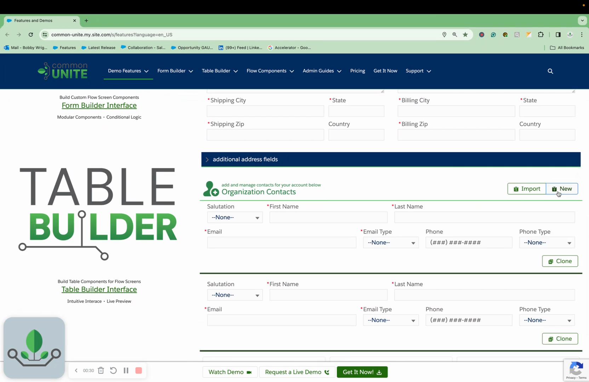
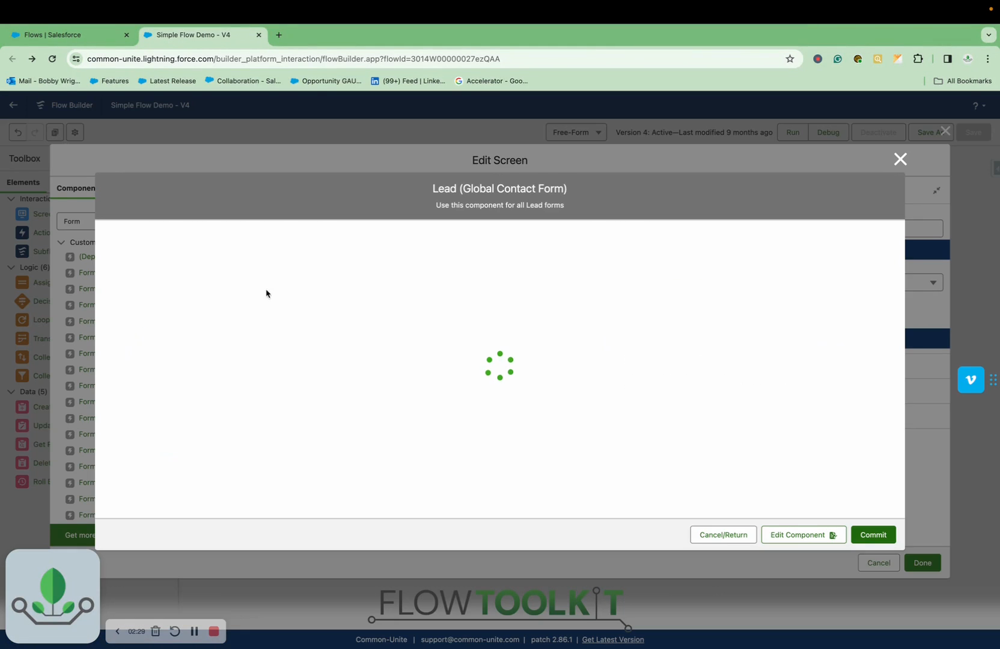
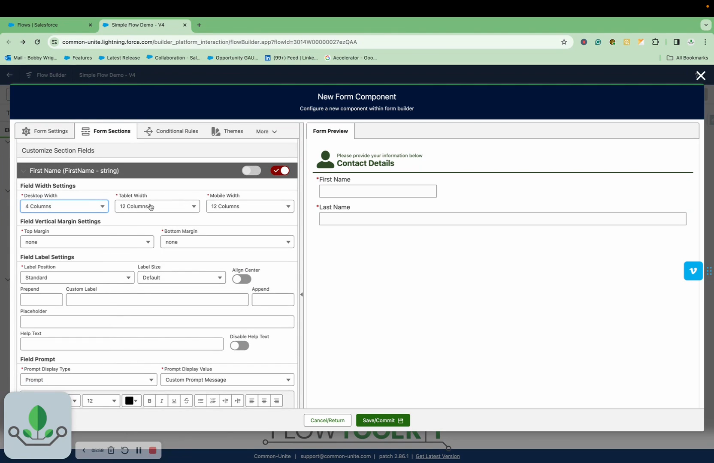
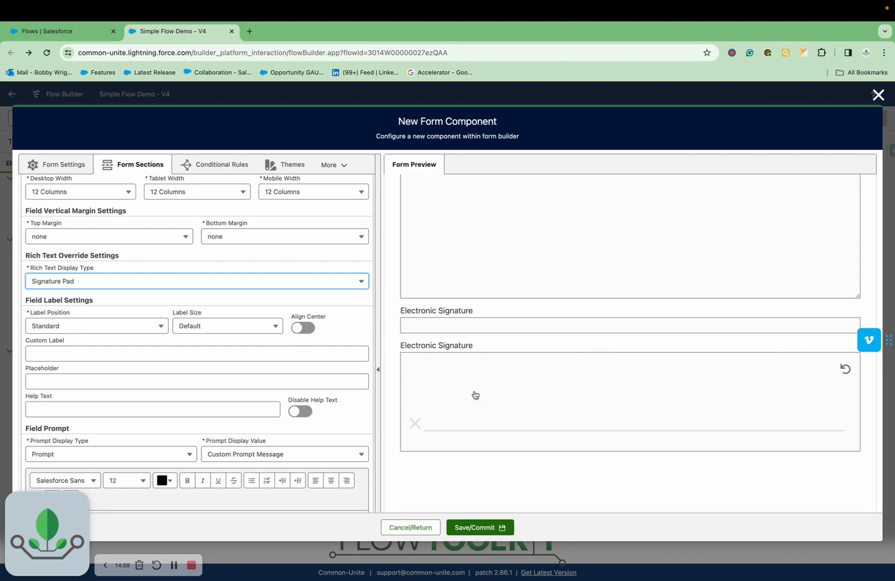

# Flow Tool Kit Documentation

> **Comprehensive documentation, analysis, and resources for Common-Unite Flow Tool Kit (Form and Table Builder)**

## 🚀 Overview

Flow Tool Kit is an enterprise-grade Salesforce package that empowers point-and-click admins and developers to build sophisticated forms and data collection solutions for both internal and external users.

### 🎯 Key Benefits
- **No-Code/Low-Code** form building within Salesforce Flow
- **28+ Advanced Components** including signature pads, file uploads, complex lookups
- **Responsive Design** with automatic mobile/tablet optimization  
- **External User Support** via Experience Cloud integration
- **Enterprise Features** like duplicate prevention, data validation, PDF generation

## 📋 Quick Navigation

- [Screenshots Gallery](./screenshots/) - Visual tour of all features
- [Feature Documentation](./documentation/features/) - Detailed capability guides  
- [Implementation Guides](./documentation/guides/) - Step-by-step setup instructions
- [Video Analysis](./videos/analysis/) - Complete breakdown of 58 training videos
- [Resources](./resources/) - Templates, examples, and tools

## 🏗️ Core Capabilities

### Form Building
- **Advanced Form Components** - Rich text, signature pads, file uploads
- **Responsive Layout System** - 12-column grid with mobile optimization
- **Conditional Logic** - Show/hide fields based on user input
- **Custom Validation** - Data quality controls and duplicate prevention

### Table Builder  
- **Dynamic Data Tables** - Add/edit records with advanced controls
- **Import/Export** - Bulk data operations with clone functionality
- **Sorting & Filtering** - User-friendly data management

### Integration & Deployment
- **Salesforce Flow Native** - Built specifically for Flow Builder
- **Experience Cloud Ready** - External user forms and portals
- **iFrame Embedding** - Deploy on external websites
- **Custom Branding** - Themes and styling options

## 📊 Feature Analysis

Based on comprehensive analysis of **58 training videos** (1.9GB total):

| Feature Category | Components | Videos | Description |
|------------------|------------|---------|-------------|  
| **Core Forms** | 12+ | 15 videos | Basic to advanced form components |
| **Data Management** | 8+ | 12 videos | Validation, duplicates, merging |
| **Advanced UX** | 6+ | 10 videos | Signatures, carousels, dynamic content |
| **Integration** | 4+ | 8 videos | Experience Cloud, iFrames, external deployment |
| **Specialized Tools** | 6+ | 13 videos | PDF generation, email templates, calculations |

## 🖼️ Screenshots Gallery

### Key Features Overview

*Live demonstration of Form and Table Builder in action*

### Flow Builder Integration  

*Native integration with Salesforce Flow Builder*

### Advanced Configuration

*Sophisticated form configuration with responsive controls*

### Digital Signature Capability

*Convert any text field to signature capture*

[→ View Complete Screenshot Gallery](./screenshots/)

## 🔧 Getting Started

### For Salesforce Admins
1. **Install Package** - Deploy Flow Tool Kit to your org
2. **Configure Objects** - Add your custom objects to Form Builder
3. **Build First Form** - Use Flow Builder with new components
4. **Deploy** - Add to Lightning pages or Experience Cloud

### For Developers
1. **Review API Documentation** - Understand component architecture  
2. **Explore Custom Components** - 28+ available input types
3. **Advanced Configurations** - Conditional logic, validation rules
4. **Integration Patterns** - iFrames, external deployment options

[→ Complete Setup Guide](./documentation/guides/getting-started.md)

## 📚 Documentation Structure

```
documentation/
├── features/           # Detailed feature documentation  
│   ├── form-builder/   # Form building capabilities
│   ├── table-builder/  # Data table functionality
│   ├── validation/     # Data quality controls
│   └── integration/    # Deployment options
├── guides/             # Step-by-step implementation
│   ├── getting-started.md
│   ├── advanced-setup.md
│   └── troubleshooting.md
└── api/               # Technical reference
    ├── components.md   # Component specifications
    └── customization.md # Advanced configuration
```

## 🎥 Video Library Analysis

Complete analysis of **58 official training videos**:
- **Total Duration**: 15+ hours of content
- **Categories**: Setup, Features, Advanced Use Cases, Real-world Demos
- **Skill Levels**: Beginner to Expert
- **Use Cases**: Internal forms, external portals, complex workflows

[→ View Complete Video Analysis](./videos/analysis/)

## 💼 Perfect for Nonprofits

Flow Tool Kit addresses common nonprofit challenges:

- **Grant Applications** - Complex multi-step forms with file uploads
- **Volunteer Management** - Registration, scheduling, feedback collection  
- **Donor Engagement** - Surveys, feedback forms, event registration
- **Program Intake** - Client registration with data validation
- **Event Management** - Registration with payment integration

**Cost-Effective**: Provides enterprise-grade functionality at a fraction of custom development costs.

## 🤝 Contributing

This documentation is maintained to support Flow Tool Kit users and the broader Salesforce nonprofit community.

### How to Contribute
- **Submit Screenshots** of new features or configurations
- **Share Implementation Examples** for specific use cases  
- **Report Issues** or documentation gaps
- **Suggest Improvements** for clarity or completeness

## 📞 Support

- **Official Documentation**: [Common-Unite Website](https://commonunite.force.com)
- **Video Library**: 58 comprehensive training videos
- **Community**: Salesforce Trailblazer Community

---

*This documentation is maintained by the Common-Unite team to support Flow Tool Kit users worldwide.*